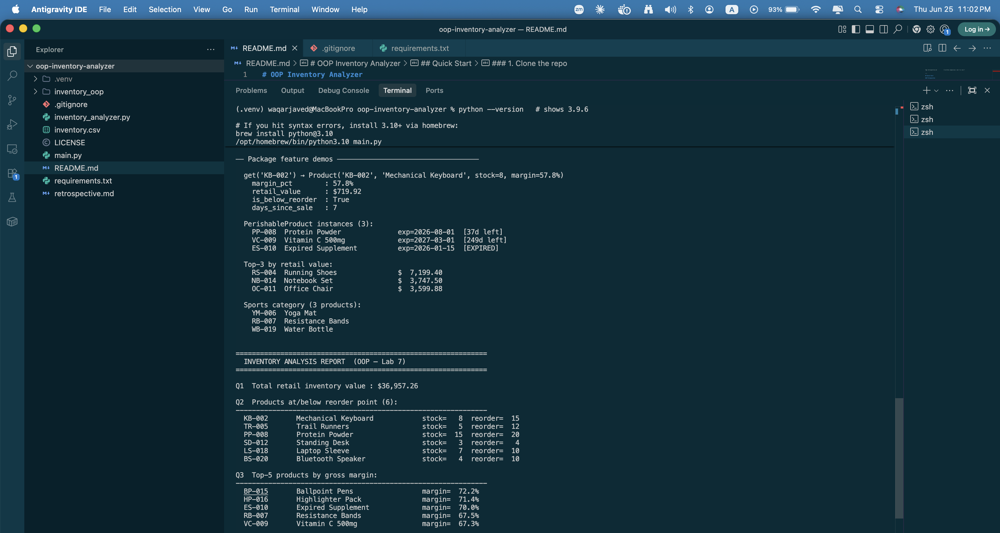
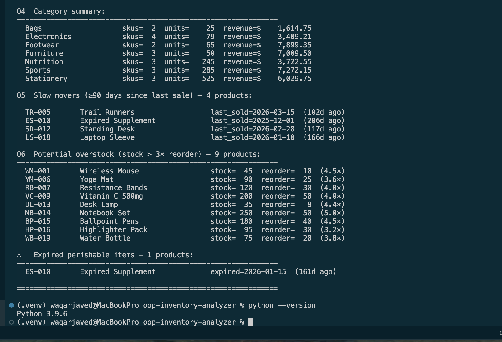
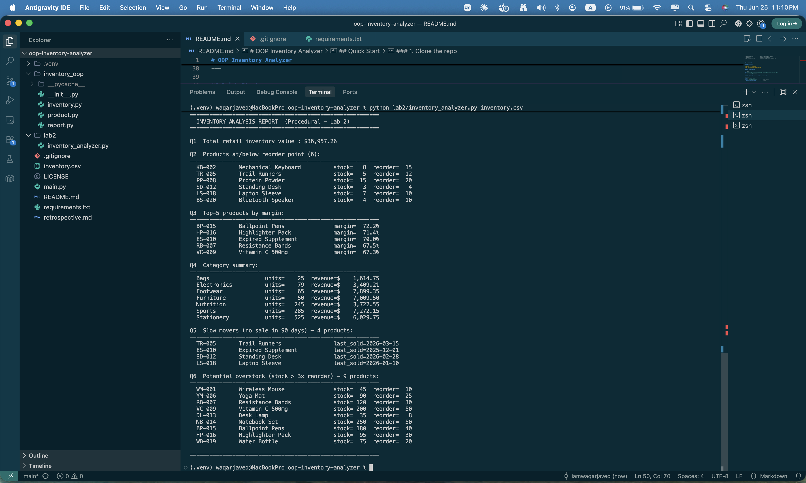
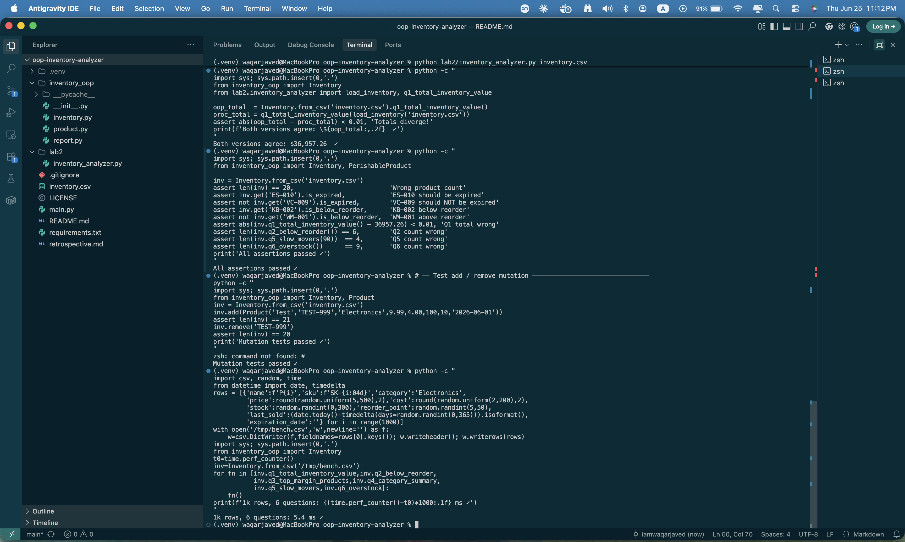

# OOP Inventory Analyzer

> **CS Lab 7** — Re-implementing a procedural inventory analyzer with
> Python's object-oriented features: dataclasses, properties, inheritance,
> alternate constructors, and the Single Responsibility Principle.


---

## What This Project Teaches

| OOP Concept | Where to Find It |
|---|---|
| `@dataclass` | `inventory_oop/product.py` — `Product` class |
| `@property` (computed attributes) | `Product.margin`, `Product.is_below_reorder` |
| Inheritance | `PerishableProduct(Product)` adds `expiration_date` + `is_expired` |
| Alternate constructor (`@classmethod`) | `Inventory.from_csv(path)` |
| Single Responsibility Principle | `Inventory` holds data; `Report` handles output |
| Package structure (`__init__.py`) | `inventory_oop/__init__.py` |

---

## Project Structure

```
oop-inventory-analyzer/
├── inventory_oop/              ← installable package
│   ├── __init__.py             ← public API surface
│   ├── product.py              ← Product dataclass + PerishableProduct subclass
│   ├── inventory.py            ← Inventory container + business query methods
│   └── report.py               ← Report formatter (separate from domain logic)
├── lab2/
│   └── inventory_analyzer.py  ← Lab 2 procedural baseline (for comparison)
├── docs/screenshots/           ← verified output screenshots
├── inventory.csv               ← 20-product sample dataset
├── main.py                     ← demo / entry point
└── retrospective.md            ← written comparison: Lab 2 vs Lab 7
```

---

## Quick Start

### Prerequisites

- Python 3.9 or higher
- No third-party packages required

### 1. Clone the repo

```bash
git clone https://github.com/iamwaqarjaved/oop-inventory-analyzer.git
cd oop-inventory-analyzer
```

### 2. (Optional) Create a virtual environment

```bash
python -m venv .venv
source .venv/bin/activate          # macOS / Linux
.venv\Scripts\activate             # Windows
```

### 3. Run the OOP version

```bash
python main.py
# or pass a custom CSV:
python main.py path/to/your_inventory.csv
```

### 4. Run the procedural baseline

```bash
python lab2/inventory_analyzer.py inventory.csv
```

Both versions produce **identical answers** — that is the point of the lab.

---

## Live Output — OOP Version (Lab 7)

Feature demos and Q1–Q3 running on the real dataset:



Q4 category summary, Q5 slow movers, Q6 overstock, and expired perishable alert:



---

## Live Output — Procedural Version (Lab 2)

Same six business questions, same numbers, one file, no classes:



---

## Test Suite — All Passing

Cross-version agreement check, 8 domain assertions, mutation tests (add/remove),
and 1k-row benchmark completing in **5.4 ms**:



---

## The Six Business Questions

| # | Question | Verified Result |
|---|---|---|
| Q1 | Total retail value of current inventory | **$36,957.26** |
| Q2 | Products at or below reorder point | **6 products** |
| Q3 | Top 5 products by profit margin | BP-015 at 72.2% |
| Q4 | Revenue and units by category | 7 categories |
| Q5 | No sale in the last 90 days | **4 products** |
| Q6 | Stock more than 3× reorder point | **9 products** |

---

## CSV Format

| Column | Type | Example |
|---|---|---|
| `name` | string | `Wireless Mouse` |
| `sku` | string | `WM-001` |
| `category` | string | `Electronics` |
| `price` | float | `29.99` |
| `cost` | float | `12.50` |
| `stock` | int | `45` |
| `reorder_point` | int | `10` |
| `last_sold` | ISO date | `2026-06-01` |
| `expiration_date` | ISO date *(optional)* | `2026-08-01` |

Rows with a non-empty `expiration_date` are automatically loaded as
`PerishableProduct` instances.

---

## Key OOP Patterns Explained

### `@dataclass` + `@property`

```python
from dataclasses import dataclass

@dataclass
class Product:
    name: str
    sku: str
    price: float
    cost: float
    stock: int
    reorder_point: int

    @property
    def margin(self) -> float:
        """Gross margin — computed from price and cost, never stored."""
        return (self.price - self.cost) / self.price if self.price else 0.0

    @property
    def is_below_reorder(self) -> bool:
        return self.stock <= self.reorder_point
```

`@property` keeps logic close to data. Anywhere you have a `Product`, you
automatically get `.margin` — no risk of forgetting to recalculate it.

---

### Inheritance for specialization

```python
@dataclass
class PerishableProduct(Product):
    expiration_date: str = ""   # adds one field

    @property
    def is_expired(self) -> bool:
        from datetime import date
        try:
            return date.today() > date.fromisoformat(self.expiration_date)
        except ValueError:
            return False
```

`PerishableProduct` IS-A `Product`. It inherits every method and property,
and adds exactly what it needs. The base class is never modified.

---

### Alternate constructor (`@classmethod`)

```python
class Inventory:
    @classmethod
    def from_csv(cls, path: str) -> "Inventory":
        inv = cls()
        with open(path) as fh:
            for row in csv.DictReader(fh):
                ...
                inv.add(product)
        return inv
```

Callers never see CSV parsing details:

```python
inv = Inventory.from_csv("inventory.csv")   # clean and self-documenting
```

---

### Single Responsibility — `Inventory` vs `Report`

| Class | Knows about |
|---|---|
| `Inventory` | Products, queries, filtering |
| `Report` | Formatting, column widths, output order |

Because these are separate, you can swap in `ReportHTML` or `ReportJSON`
without touching a single line of `Inventory`.

---

## Lab 2 vs Lab 7 — At a Glance

| Metric | Lab 2 Procedural | Lab 7 OOP |
|---|---|---|
| Files | 1 | 5 |
| Logical lines | 101 | 353 |
| 1k-row benchmark | ~5 ms | ~5.4 ms |
| Adding a new question | 1 file, ~3 min | 2 files, ~4 min |
| Adding a product subtype | Extend every dict | Subclass `Product` |
| Swap output format | Rewrite `print_report()` | Subclass `Report` |

Full analysis → [`retrospective.md`](./retrospective.md)

---

## Running the Tests

```bash
# Cross-version agreement
python -c "
import sys; sys.path.insert(0,'.')
from inventory_oop import Inventory
from lab2.inventory_analyzer import load_inventory, q1_total_inventory_value
oop_total  = Inventory.from_csv('inventory.csv').q1_total_inventory_value()
proc_total = q1_total_inventory_value(load_inventory('inventory.csv'))
assert abs(oop_total - proc_total) < 0.01
print(f'Both versions agree: \${oop_total:,.2f}  ✓')
"

# Full domain assertion suite
python -c "
import sys; sys.path.insert(0,'.')
from inventory_oop import Inventory, PerishableProduct
inv = Inventory.from_csv('inventory.csv')
assert len(inv) == 20
assert inv.get('ES-010').is_expired
assert not inv.get('VC-009').is_expired
assert inv.get('KB-002').is_below_reorder
assert abs(inv.q1_total_inventory_value() - 36957.26) < 0.01
assert len(inv.q2_below_reorder()) == 6
assert len(inv.q5_slow_movers(90))  == 4
assert len(inv.q6_overstock())      == 9
print('All assertions passed ✓')
"
```

Expected: `All assertions passed ✓` — verified on Python 3.9.6, macOS.

---

## License

MIT — use freely for learning and coursework.